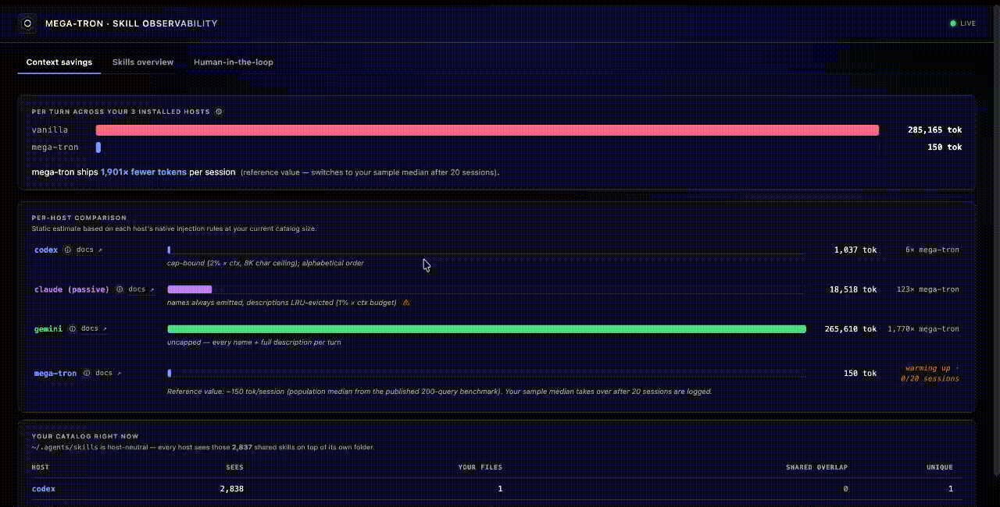
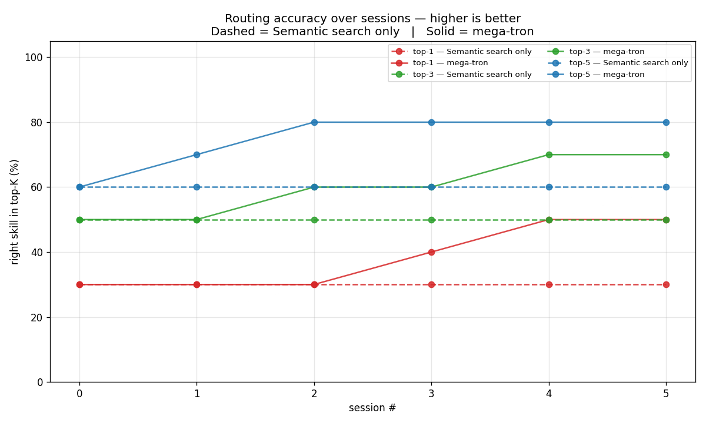

<a id="readme-top"></a>

<div align="center">
  

  <h1>MEGA Tron</h1>

  <p><strong>The skill OS for Codex, Claude Code, and Gemini CLI.</strong><br>
  One pool, one router, one feedback loop — across all three hosts.</p>

  <p>
    <a href="./LICENSE"></a>
    <a href="https://github.com/mega-edo/mega-tron"></a>
    <a href="#-does-it-actually-work--measured"></a>
    <a href="#-does-it-actually-work--measured"></a>
    <a href="#-install"></a>
  </p>

  <p>
    🤖 <strong>If you are an AI assistant installing or updating mega-tron for a user</strong>, follow <a href="docs/agent%20installation.md"><code>docs/agent installation.md</code></a> — it has explicit user-confirmation gates (embedder profile, Claude suppression level, post-install QA) and an "already installed — refresh first" branch so you know when to ask and when to act.
  </p>

  <p>
    <a href="#-install">Install</a> ·
    <a href="#-three-problems-that-compound-with-more-skills">Why</a> ·
    <a href="#-does-it-actually-work--measured">Benchmark</a> ·
    <a href="#-see-what-your-skills-are-actually-doing">Dashboard</a> ·
    <a href="#-the-architecture-unify--optimize--evolve">Architecture</a> ·
    <a href="#-cli">CLI</a> ·
    <a href="https://megacode.ai"><strong>megacode.ai ↗</strong></a>
  </p>
</div>

---

## ✨ Three problems that compound with more skills

- **🧨 Token leak.** Type `hi` into Gemini CLI with 150 skills enabled and **~8,400 tokens** of skill metadata ship along with it. Codex and Claude cap their catalogs (8K chars / ~2K tokens), but they still inject the cap-full *every turn* (Codex) or *every session* (Claude), filled by alphabet or by past-usage frequency. **Never by what you actually typed.**

> 💡 **The waste is structural.** The hosts have never seen your current prompt when they decide what to inject — so even a one-word greeting drags the entire catalog along.

> **Quick check** — open your host CLI and count what's loaded. Most users believe they have "maybe 20 skills." Once you count the host's bundles + everything you installed, it's typically **2–5× that**. All of it ships, regardless of relevance.

- **🏝 Host isolation.** You spent a week tuning `webhook-signer` in Codex. Tomorrow you open Claude Code on the same project — `webhook-signer` isn't there, or it's an older copy you forgot to update. **Editing a skill is a per-host chore**, and forgetting one host means that host quietly runs a stale version for weeks.

> 💡 **The three CLIs are three islands — same skills in name, drifting in content.** Editing a skill is a per-host chore, and forgetting one host means that host quietly runs a stale version for weeks.

> [!NOTE]
> Gemini CLI is [merging into Antigravity CLI](https://developers.googleblog.com/an-important-update-transitioning-gemini-cli-to-antigravity-cli/) — same architecture, same island problem. The host count keeps going up, not down.

- **🙈 Evidence blind.** Which 5 of your skills actually shifted an answer for the better last month? Which 3 are silently broken against a library update from last week? You don't know. **None of the three hosts records whether a skill *actually helped*** when it was loaded. Claude tracks invocation *frequency*, but frequency isn't quality — "least-invoked-first" eviction protects exactly the *harmful but frequent* skills you'd want to drop.

> 💡 **The model picks a broken skill, the skill fails silently, next turn it tries the same broken skill again.** You see "the answer is weird" without knowing a stale skill is behind it.

> 📐 **The measurements behind these problems** are documented per-host: [Claude Code](docs/Native%20Skill%20Catalog%20in%20Claude%20Code.md) · [Codex CLI](docs/Native%20Skill%20Catalog%20in%20Codex%20CLI.md) · [Gemini CLI](docs/Native%20Skill%20Catalog%20in%20Gemini%20CLI.md). Each one walks through storage layout, the catalog-injection pipeline, the structural limits that fall out of the design, and the 500-skill benchmark numbers behind the table below.

## 🧩 Same root cause behind all three problems

Each host's skill catalog is a **one-shot system-prompt injection** that:

1. **Ignores your current prompt** when deciding what to ship → token leak
2. **Lives inside one host** with no cross-host channel → island problem
3. **Records nothing about outcomes** → evidence blind

mega-tron rebuilds the catalog layer above each host so all three properties flip. The architecture maps one-for-one:

| Problem | Fix | Component |
|---|---|---|
| Token leak | **Optimize** — per-turn semantic top-K against your actual prompt, ~600 tok regardless of pool size | `router.py`, `dynamic_k.py` |
| Host isolation | **Unify** — one master pool, symlinks to every host, cross-host verdict economy | `pool.py` |
| Evidence blind | **Evolve** — session-end self-evaluation, evidence-blended ranking, auto-retirement of broken skills | `verdicts/` |

## 🏃 Try it

```bash
uv tool install mega-tron && ~/.local/bin/mega-tron setup
```

Then open a new terminal. The next turn in any host ships with the right skills in context — and never with skills that have silently broken on you. (Why two commands? See [Install](#-install) below.)

Two commands, three hosts. Token usage drops 18–30× on the very next turn without changing how you use any CLI. Full benchmark table and installation details below.

## 🎯 What mega-tron actually does

Mega-tron is a local layer that sits above Codex, Claude Code, and Gemini CLI and fixes four things:

1. **Router — per-turn semantic top-K.** Your prompt gets embedded, ranked against every skill in your pool, and only the relevant ones ship. Flat ~600 tokens/turn whether you have 30 skills or 500. In [benchmarks](#-does-it-actually-work--measured): 0.96 coverage at ~100 tokens vs. native hosts' 0.71–0.75 at 1,200–3,500 tokens.

2. **Observability — every skill use captured as a verdict** (HELPFUL / HARMFUL / NEUTRAL) with the prompt context, source host, and reason. The [built-in dashboard](#-see-what-your-skills-are-actually-doing) surfaces which skills are pulling their weight, which silently broke after last week's API update, and how performance trends across hosts — so you have a feedback signal instead of guessing from "the answer felt weird."

3. **Unified pool — one master copy of each skill** under `$XDG_DATA_HOME/mega-tron/pool/`, symlinked into every host. Edit `webhook-signer` once and Codex, Claude, and Gemini all see the fix on the next turn. No more three drifting islands.

4. **Self-improvement — a Stop-hook reads the transcript** at session end, the model self-grades the skills it used, and verdicts feed back into ranking. A skill that fails three sessions in a row auto-archives; a `HELPFUL` in Claude lifts the same skill's rank when Codex hits a similar prompt next week. Cold-start skills are protected — no evidence means pure cosine, never penalized.

## 🔭 See what your skills are actually doing

`mega-tron dashboard` opens a local web UI that un-blackboxes the verdict economy: every `HELPFUL` / `HARMFUL` / `NEUTRAL` the three CLIs recorded automatically, plus the verdicts you add by hand. Edit, relabel, or delete any of them and the change feeds back into routing on the very next turn.



- **Skills overview** — total catalog size, host distribution, the skills active in the last 30 days, and the net-most-helpful list. Quick read on what your install is actually doing.
- **Human-in-the-loop** — every recorded verdict, filterable by title / description / host, with a per-skill detail pane for relabeling and adding your own verdicts. Your manual verdicts carry the same weight in ranking as the host-recorded ones.

```bash
mega-tron dashboard               # opens http://127.0.0.1:7531 in your browser
mega-tron dashboard --port 8080   # custom port
```

Read-only by default for the host-recorded verdicts; explicit click-to-edit for everything. All data stays in the local SQLite store — no network calls, no telemetry.

## 📊 Does it actually work? 

A 200-query benchmark on a pool of third-party skills sampled deterministically from the open-source ecosystem ([full report](benchmarks/routing/results.md)). No API calls; every number below is from [the repo](benchmarks/routing/).

**Coverage** = fraction of the "gold" skills the model can actually see for each prompt, averaged over 150 in-distribution + 50 null prompts. Native hosts can never abstain on null prompts, which is why they cap at 0.750 regardless of pool size.

| Pool size | Policy | Coverage | Tokens / turn | MEGA Tron token savings |
|---:|---|---:|---:|---:|
| **59** | vanilla Codex | 0.708 | 1,193 | 11.3× |
| | vanilla Claude | 0.750 | 1,972 | 18.6× |
| | vanilla Gemini | 0.750 | 3,562 | 33.6× |
| | **MEGA Tron (`SKILLRET-Embedding-0.6B`)** | **0.955** | **106** | **1.0×** (baseline) |
| **183** | vanilla Codex | 0.185 | 1,157 | 9.3× |
| | vanilla Claude | 0.750 | 2,000 | 16.1× |
| | vanilla Gemini | 0.750 | 10,554 | 85.1× |
| | **MEGA Tron (`SKILLRET-Embedding-0.6B`)** | **0.935** | **124** | **1.0×** (baseline) |
| **500** | vanilla Codex | 0.029 | 1,191 | 7.6× |
| | vanilla Claude | 0.750 | 3,400 | 21.7× |
| | vanilla Gemini | 0.750 | 29,295 | 186.6× |
| | **MEGA Tron (`SKILLRET-Embedding-0.6B`)** | **0.892** | **157** | **1.0×** (baseline) |

The last column reads as *"that row uses this many times more tokens than MEGA Tron,"* and mega-tron still scores higher on coverage at every row.

As the pool grows, the gap widens on both axes: vanilla Codex's alphabetical char-budget drops 96% of its coverage by 500 skills (0.708 → 0.029), vanilla Gemini's catalog grows 8× in tokens, and MEGA Tron stays flat near 0.9 coverage at ~150 tokens.

> [!TIP]
> The benchmark's smallest pool (**pool=59**) is already comparable to a normal install. For reference: [anthropics/skills](https://github.com/anthropics/skills) (Anthropic's published Claude Code starter catalog) holds **17 skills**, [obra/superpowers](https://github.com/obra/superpowers) (the most popular community extension) **14 more**, and [openai/codex](https://github.com/openai/codex) bundles **5 sample skills** out of the box. Add anything the user has installed themselves and a real catalog quickly reaches 59 and beyond. At pool=59 MEGA Tron already lifts coverage from 0.71–0.75 to **0.955** while shipping **~11× fewer tokens than Codex, ~19× than Claude, ~34× than Gemini** — and the gap only widens as the pool grows (at 500 skills the token savings climb to **8× / 22× / 187×** and Codex's coverage collapses to 0.029).

**Cap ≠ fix.** When the host caps its catalog (Codex's `min(2% × ctx, 8,000 chars)` or Claude's `skillListingBudgetFraction`), the *content* of what survives is decided by alphabet or by invocation frequency — never by what you actually typed.

### And it keeps getting better the more you use it

A 6-round feedback-loop experiment on a fixture of 80 skills, including 5 booby-trapped twins engineered to beat the real skills on raw cosine ([full report](benchmarks/feedback_loop/results.md)). Driven by live Gemini CLI calls (`gemini-3-flash-preview`, 13 prompts × 6 rounds × 2 conditions per run) so the loop is exercised end-to-end against a real host; raw run artefacts and graphs in [the repo](benchmarks/feedback_loop/). The numbers above are MEGA Tron's *day-1* routing quality; here top-3 routing accuracy climbs from **50% to 70% over 6 rounds** — while the same router with feedback disabled stays flat at 50%.



Solid lines = MEGA Tron. Dashed = semantic search only. Same router, same questions, same model — the only thing that changes is whether yesterday's outcomes inform today's ranking.

> [!TIP]
> **+20 percentage points in 6 rounds.** Pure semantic search plateaus at 50% because the booby-trapped twins beat the real skills on cosine alone — without an outcome signal there's no way to break the tie. Each verdict ages the bad twins out and pulls the real skills up; by round 6 hit rate is 70% and still climbing. **Your router doesn't just stay the same — it learns from how you actually work.**

## 🚀 Install

Requires Python ≥ 3.11 and [`uv`](https://docs.astral.sh/uv/).

### Recommended: let your agent install (or update) it

Open Codex / Claude Code / Gemini and paste:

> **Read [`docs/agent installation.md`](docs/agent%20installation.md) from the mega-tron repo and install or update mega-tron on my machine following that procedure.**

The doc is a step-by-step procedure written *for the agent*. It picks the right embedder profile based on the language you've been speaking, picks the right Claude Code native-mode (passive / active / strict) based on your skill count, runs the post-install end-to-end check, and asks you at every decision point instead of choosing silently. If you already have mega-tron installed, the same procedure detects that and refreshes the binary first — so re-running it after a new release is the supported upgrade path, not a separate flow.

This is the path most users want — installation involves three host-specific choices and an embedder model download, and an agent following a written procedure will get those right faster than you can read this README.

### Manual install (if you'd rather drive it yourself)

```bash
uv tool install mega-tron
```
```bash
~/.local/bin/mega-tron setup
```

Open a new terminal afterwards so the PATH update takes effect — then `mega-tron`, the `codex` shell wrapper, and the host CLIs all resolve cleanly.

> [!NOTE]
> Step 1 installs the *binary*. Step 2 wires the binary into your environment (PATH + Codex / Claude / Gemini hooks + cache warmup). They're separate because `uv tool install` doesn't get to run scripts on your machine, and editing hooks across three CLIs needs explicit consent.

`mega-tron setup` accepts `--profile {multilingual,en-quality,en-fast}` and `--claude-native-mode {passive,active,strict}`; without these flags it picks safe defaults (multilingual / passive) — see [`docs/agent installation.md`](docs/agent%20installation.md) for what each one means and when to pick which.

### From a git clone

```bash
git clone https://github.com/mega-edo/mega-tron && cd mega-tron
```
```bash
sh install.sh
```

`install.sh` runs the two commands above in one shot, plus auto-installs `uv` itself if you don't have it.

### Then use any host normally

```bash
codex                                    # interactive REPL — routed via UserPromptSubmit hook
codex exec "Implement HMAC-SHA256 webhook signature verification"   # one-shot — routed via shell wrapper
claude                                   # same router, same skill pool
gemini                                   # same router, same skill pool
```

Both `codex` (interactive REPL) and `codex exec` (one-shot non-interactive) are routed — they take different paths (`UserPromptSubmit` hook for the REPL, shell `codex()` wrapper for `exec`) but reach the same top-K injection. Claude Code and Gemini CLI each use a single hook that covers both their interactive and non-interactive modes.

> [!TIP]
> `mega-tron setup` is idempotent — safe to re-run any time you add a new host or want to refresh the wiring. `mega-tron install` is kept as an alias. First-run cost: ~1–3 minutes for the embedder model download (130 MB – 570 MB depending on the profile you pick — see [Picking an embedder](#picking-an-embedder)) plus one-time embedding of every discovered skill. Subsequent runs reuse the cache and finish in seconds.

<details>
<summary>What <code>mega-tron setup</code> does, all idempotent</summary>

- **Embedder profile** — on a fresh install (TTY only) prompts you to pick one of three pre-tuned profiles: English-quality (SkillRet-0.6B), English-fast (bge-small-en), or multilingual (bge-m3, the default). Override with `--profile {en-quality,en-fast,multilingual}` for non-interactive installs (CI, scripts, `MEGA_QUIET=1`). Skipped on re-runs once you've picked once. See [§Picking an embedder](#picking-an-embedder) for the numbers behind each option.
- **PATH** — adds `~/.local/bin` to your shell config (`~/.zshenv` for zsh, `~/.bashrc` for bash, fish conf.d for fish) inside a sentinel-bracketed block so hook subprocesses can resolve `mega-tron` even from non-interactive shells.
- **Hosts** — registers the right hook entries in `~/.codex/hooks.json`, `~/.claude/settings.json`, `~/.gemini/settings.json` and writes the persistent guidance block into each host's `AGENTS.md` / `CLAUDE.md` / `GEMINI.md`.
- **Codex shell wrapper** — drops a `codex()` function into `~/.zshrc` / `~/.bashrc` so `codex exec` non-interactive calls also route through the top-K stager.
- **Cache warmup** — downloads the embedder model (if absent) and embeds every discovered skill into `~/.cache/mega-tron/<model>.npz` so the very first session starts hot.

Target options: `mega-tron setup --target codex | claude | gemini | auto | all`. `--uninstall` reverses each cleanly — sentinel-bracketed install blocks, managed hook entries, the PATH block, and any `skillOverrides` we own are stripped; user-owned settings preserved.

</details>

### Updating

```bash
uv tool upgrade mega-tron     # PyPI install
# or, from a git clone:
git pull && uv tool install --force --reinstall --from . mega-tron
```

Both replace the underlying venv, so the warm router daemon dies with it — your next host session pays one cold embedder load (~5–30s) and respawns the daemon in the background. Re-run `mega-tron setup` only if you want to re-warm the cache upfront or refresh hook wiring after a major version.

### Optional dependencies

```bash
uv add 'mega-tron[agentic-litellm]'
```
```bash
uv add 'mega-tron[voyage]'
```
```bash
uv add 'mega-tron[openai]'
```

## 🔒 Routing runs on your machine

mega-tron's routing runs **entirely on your machine**. No API keys to manage, no per-call cost, and the skill-ranking path never leaves the box.

- **🔐 Privacy.** Your prompts and skill bodies stay local during routing. The embedder runs on CPU/MPS/CUDA depending on what you have; the routing path never crosses the network.
- **💸 Cost.** Zero marginal cost per turn. The only one-time expense is the embedder download (130 MB – 570 MB depending on the profile).
- **✈️ Offline.** Works on a plane. Works behind a corp firewall. Works when OpenAI is down.
- **🔓 No vendor lock-in.** Embedder is swappable (BGE-M3, SkillRet, Qwen3, Voyage, OpenAI). Skill files are plain markdown.

Agentic re-rank (`--mode agentic`) is the *one* optional path that calls an LLM, and even there you bring your own key (Codex subscription, OpenAI, Anthropic).

## 🏗 The architecture: Unify → Optimize → Evolve

```
   ~/.codex/skills ────┐
                       │
   ~/.claude/skills ───┼──► ① UNIFY      master pool + cross-host symlinks
                       │     (pool.py)     verdict economy across hosts
   ~/.gemini/skills ───┘

                       ▼

                         ② OPTIMIZE    per-turn semantic top-K
                         (router +       dynamic K from score distribution
                          dynamic_k)     flat token cost regardless of pool size

                       ▼

                         ③ EVOLVE      Stop-hook self-evaluation
                         (verdicts/)    adapts ranking from past results
                                        retires skills that consistently fail
```

Three composable layers. Each works on its own; together they form a self-improving skill substrate that any of the three hosts can plug into.

### ① Unify — one pool, three hosts

> **What you'll feel:** edit a skill once, and Codex, Claude, and Gemini all see the fix on the very next turn. A `HELPFUL` recorded in one host lifts that skill's rank in the others.

A skill is the same `SKILL.md` regardless of which CLI invokes it. MEGA Tron treats the three native locations as a single logical pool, with **one master copy** under `$XDG_DATA_HOME/mega-tron/pool/skills/` and symlinks fanning out to each host.

```bash
# Promote a skill into the master pool — original location becomes a symlink
mega-tron skills promote webhook-signer

# Mirror the entire pool into the hosts you have installed
mega-tron skills sync

# Show every skill across every host with its canonical location
mega-tron skills list
```

Two consequences:

- **Edit once, applies everywhere.** Fix a bug in `webhook-signer` and Codex, Claude, and Gemini all see the fix on the next turn.
- **Cross-host verdict economy.** Because MEGA Tron is the layer that *records* the verdicts in the first place (the hosts themselves don't), every `HELPFUL` / `HARMFUL` is tagged with its source host and pooled into a single store. A win in Claude Code lifts the same skill's rank when Codex hits a similar prompt next week.

The router's discovery pass unions `~/.claude/skills`, `~/.codex/skills`, `~/.gemini/skills`, `~/.hermes/skills`, `~/.agents/skills` (host-neutral shared convention used by several agent tools), `$CODEX_HOME/skills`, the codex bundled `.system` cache, any `extra_dirs` from your config, and `MEGA_SKILL_DIRS=…`. The MEGA-Code wisdom-gateway directory (`~/.local/share/mega-code/skills`) is opt-in behind `MEGA_WITH_WISDOM=1`.

Two dedup passes, both using the same winner-priority rule (status `active` > `suspect` > `archived` → net verdict score `helpful − harmful` → SKILL.md mtime):

- **Exact `name:` collisions** — runs every warmup. If `tdd` exists under `~/.claude/skills/` *and* `~/.codex/skills/`, the one with the better verdict history wins. The verdict-feedback loop's whole point is that this signal reflects real-world evidence; resolving collisions by discovery order alone would waste it.
- **Semantic near-duplicates** — different filenames, same job (`tdd` / `tdd-guide` / `Test-Driven Development (TDD)` all sit in the catalog at once). Run on demand: `mega-tron compact-skills` clusters each skill's cached `name + description` embedding at cosine ≥ 0.95 and suppresses the losers. (Same vector the router already uses to rank against your prompt — so two SKILL.md files that route identically also dedup together.) Dry-run by default; `--apply` writes a sidecar next to the cache so suppression survives restarts, `--reset` lifts it.

### ② Optimize — per-turn context engineering

> **What you'll feel:** ~600 tokens per turn for skill context, whether you have 30 skills or 300. The catalog is rebuilt *per turn, given your actual prompt*. Pool size becomes irrelevant.

<details>
<summary>Stage 1 — semantic top-K (embedder choice + benchmark)</summary>

A task-specific retrieval embedder (BGE-M3 by default; SkillRet-Embedding-0.6B, Qwen3-Embedding, Voyage, OpenAI all swappable) ranks every skill against the query. The embedder is asymmetric — query gets an instruction prefix, documents stay plain — so cross-lingual retrieval (Korean → English skill descriptions, Japanese → English, etc.) just works.

#### Picking an embedder

`mega-tron setup` asks you which profile to install on the first interactive run, and `--profile {en-quality,en-fast,multilingual}` overrides the prompt for non-interactive installs. The three profiles map onto the three embedders below; all three are measured against the same 200-query benchmark at pool=500:

| Profile | Embedder | Coverage | Tokens / turn | Latency (p50) | Pick when |
|---|---|---:|---:|---:|---|
| `multilingual` (default) | `BAAI/bge-m3` | 0.840 | 208 | 44 ms | Prompts or skills in any non-English language (~100 supported) |
| `en-quality` | `ThakiCloud/SKILLRET-Embedding-0.6B` | **0.892** | **157** | 68 ms | English-only pool, rank quality matters most |
| `en-fast` | `BAAI/bge-small-en-v1.5` | 0.884 | 527 | **12 ms** | English-only pool, fastest warmup / smallest footprint |

- **`BAAI/bge-m3`** — 1024d, ~570 MB. Strong cross-lingual retrieval out of the box.
- **`ThakiCloud/SKILLRET-Embedding-0.6B`** — a Qwen3-0.6B fine-tune purpose-built for skill retrieval. Published NDCG@10 on the SkillRet test set is 0.7803 (vs BGE-large 0.5582).
- **`BAAI/bge-small-en-v1.5`** — 384d, ~130 MB. Encodes in milliseconds even on CPU. Recall is lower per-query so MEGA Tron's dynamic-K widens the window automatically to compensate (visible in the higher token cost).

Switch any time with `mega-tron embedder set <huggingface-id>` — the cache is fingerprinted per-embedder so swaps never reuse stale vectors.

Then a fast matmul: `(1, dim) × (dim, N)` cosine. ~15 ms on cached vectors for 150 skills, sub-50 ms even at 500.

</details>

<details>
<summary>Stage 2 — dynamic K from the score distribution</summary>

A fixed top-5 is too rigid. Some prompts are unambiguous (one obvious skill); some are genuinely null (no skill applies); some are ambiguous (a cluster of close candidates the model needs to pick from). MEGA Tron decides K **from the shape of the score distribution itself** ([`dynamic_k.py`](src/mega_tron/dynamic_k.py)):

```
                       │ z_top1 high, z_entropy low      →  one dominant skill, K = small (gap-cut)
score distribution     │ z_top1 low,  z_entropy high     →  uniform noise, K = 0 (null prompt)
becomes ───────────►   │ z_entropy very high             →  ambiguous, K = wider window
                       │ scores[0] < embedder abs_floor  →  nonsense, K = 0
```

The `abs_floor` is set per-embedder because "good enough" varies by model. The default policy returns `(K, reason)` — e.g. `(2, "gap-cut@2")`, `(0, "uniform-null")` — visible in CLI telemetry.

</details>

<details>
<summary>Stage 3 — host-shaped injection</summary>

The top-K is rendered into each host's native injection point with the right trigger convention:

| Host | Trigger form | Native catalog handling |
|---|---|---|
| **Codex** | bare identifiers | `~/.codex/config.toml` `include_instructions = false` — native catalog off entirely |
| **Claude** | `/skill-name` slash | passive overlay (default) or active `skillOverrides` downgrade to name-only |
| **Gemini** | `activate_skill` tool call | `skills.disabled` array rewritten per-turn; SKILL.md body **inlined** into the prompt (workspace-trust sandbox can't `read_file`) |

Claude Code has no persistent kill switch for its native catalog — the only flags that drop it (`--disallowedTools Skill`, `--bare`, `--tools "<allow-list>"`) are per-invocation, so MEGA Tron uses `skillOverrides` in `settings.local.json` to downgrade non-top-K skills to name-only on every turn instead. The shell wrapper (Codex only — `~/.zshrc` / `~/.bashrc`) intercepts `codex exec` for non-interactive sessions; the `UserPromptSubmit` hook handles the rest. All idempotent, all reversible with `mega-tron install --uninstall`.

</details>

<details>
<summary>Optional — agentic re-rank</summary>

`--mode agentic` adds a HyDE-style decompose step + 1–2 LLM calls (Codex subscription, OpenAI, Anthropic — anything `litellm` supports) on top of the embedder pre-filter. Best when the cosine prefilter is *uncertain* — close score cluster, ambiguous query, multi-skill task. Skip-when-confident gate avoids the LLM call when the cosine top-1 already dominates; `pin_cosine_top1` keeps the strong embedder's first pick fixed and lets the LLM rerank the rest. Fail-open to cosine on any backend error.

</details>

### ③ Evolve — self-improving via verdict feedback

> **What you'll feel:** a skill that broke against the latest API version stops appearing in your top-K within 3 sessions. A skill that consistently helps gets a measurable rank bump.

The ranking formula combines four signals — pure cosine plus three forms of evidence accumulated from past sessions:

```
final = cosine
      + small bonus from past helpful uses
      + boost when the current query matches a past helpful context
      + boost from semantically similar past verdicts
      × status multiplier (active / suspect / archived)
```

Cold-start skills with no evidence are unaffected (the blend collapses to pure cosine), so unevaluated skills are never penalized against evaluated peers. See [`docs/routing-algorithm.md`](docs/routing-algorithm.md) for the precise formula and weight tuning.

<details>
<summary>Observe — session-end self-evaluation</summary>

When the session ends, the `Stop` (or `AfterAgent`) hook scans the transcript for the model's own `<skill-used name="..." verdict="..." reason="..."/>` tags, plus any `<skills_root>/<name>/scripts/` invocations from the tool-use log. Skill use is detected three ways:

- `informed_use` — the model both ran the skill *and* self-graded it
- `silent_use` — script ran but no tag emitted
- `claimed_use` — tag emitted but no actual invocation observed

Codex / Claude run a single-phase silent extractor (their `Stop` hook UX makes a second LLM-eval turn user-visible). Gemini stays 2-phase live — its `decision:"deny".reason` field routes back into the model as a retry, so a full evidence-grounded eval prompt can fire.

</details>

<details>
<summary>Persist — three sources of truth, dual-write</summary>

```
verdict ──┬─► SQLite        (verdicts table, FTS5, time-series spine)
          ├─► frontmatter   (mega_meta: helpful_count, harmful_count, contexts, status)
          └─► npz           (verdict_embeddings.npz, related-verdict cosine lookup)
```

Each store is independently restorable from the others (`resync_from_store`, SHA-keyed cache invalidation, schema-mismatch silent rebuild). A stale install, a fresh laptop, a missing embedding store — system degrades gracefully.

Anti-noise guards: omitted tags carry no signal (silence is the "no evidence" escape hatch); reasons like `"ok"`, `"test"`, `"r1"` are blocked from the embedding corpus; `UNIQUE(session_id, skill_name, host)` dedups retries.

</details>

<details>
<summary>Adapt — the full formula, for the curious</summary>

```
final = (semantic
         + 0.10 × beta_smoothed_count_bonus
         + 0.15 × (helpful_ctx_match − 1.5 × harmful_ctx_match)
         + 0.10 × (related_helpful_max − related_harmful_max)
        ) × status_multiplier        # active = 1.0, suspect = 0.5, archived = −1
```

- **count bonus** is Beta-smoothed with a ramp at 10 invocations — cold-start skills contribute zero, the blend degrades cleanly back to cosine
- **context match** compares the *current* query against natural-language `helpful_contexts` / `harmful_contexts` strings, so "validate JWT audience" and "rotate JWT signing keys" stay separated even though they share a skill
- **harmful weight is 1.5× helpful** — false-positives are cheaper than false-negatives, so we punish HARMFUL evidence asymmetrically
- **related verdict** consults the embedding store for the most semantically similar past verdicts and pulls their polarity in

</details>

<details>
<summary>Retire — two rules</summary>

- `consecutive_harmful ≥ 3` → `archived` (drops out of candidate sets entirely). One-way: any HELPFUL resets the streak, but once archived, restoration is a one-line edit in the skill's `mega_meta.status`.
- After ≥ 5 total verdicts, `harmful_count > 3` **or** `harmful_ratio > 0.3` → `suspect` (rank halved). Auto-restores to `active` once `harmful_ratio ≤ 0.15` **and** `harmful_count ≤ 1`. Under 5 verdicts the skill stays `active` regardless — cold-start protection.

</details>

> 📚 **Want the algorithmic details?** See [`docs/routing-algorithm.md`](docs/routing-algorithm.md) for the full ranking formula (semantic + verdict blend), the active/suspect/archived status lifecycle, and dynamic K selection. For how MEGA Tron wires into each host (hook surfaces, catalog suppression mechanisms, wire formats), see [`docs/mega-tron routing.md`](docs/mega-tron%20routing.md). Per-host *native* catalog behaviour is documented above under [Three problems](#-three-problems-that-compound-with-more-skills).

## 🔧 CLI

```bash
# Routing
mega-tron search "validate webhook HMAC signature"            # top-K, one card per pick
mega-tron search "..." --output bodies                        # full SKILL.md, what an agent reads
mega-tron search "..." --mode agentic                         # add LLM re-rank
mega-tron why "validate HMAC webhook" webhook-signer          # score decomposition

# Cross-host pool
mega-tron skills list                                         # every skill, every host
mega-tron skills promote <name>                               # move into master pool
mega-tron skills mirror   <name> --host claude                # symlink into one host
mega-tron skills sync                                         # mirror master pool into every detected host

# Verdict analytics
mega-tron stats --by-host                                     # helpful/harmful per (skill, host)
mega-tron regressions                                         # broken / regressed in last 30 days
mega-tron search-verdicts "rate limit"                        # FTS5 full-text over reasons
mega-tron compact-embeddings                                  # cluster near-duplicate verdicts
mega-tron compact-skills                                      # dry-run: cluster near-duplicate SKILL.md files
mega-tron compact-skills --apply                              # persist suppressions; --reset to lift
mega-tron qa-live                                             # end-to-end check: plant a marker skill, drive each wired host once, confirm verdicts land

# Config
mega-tron dirs list / add / remove
mega-tron embedder show / set <huggingface-id>
```

Full `--output` reference (`meta` / `names` / `bodies` / `table` / `stage`) and per-knob pipeline diagram in [`docs/mega-tron routing.md`](docs/mega-tron%20routing.md). `MEGA_SKILL_DIRS=path1:path2` works as an ephemeral override for CI.

## ⚡ Warm daemon

```bash
mega-tron daemon status
mega-tron daemon serve          # foreground (debug)
mega-tron daemon stop
MEGA_DAEMON=0 codex             # disable the daemon path
```

`mega-trond` keeps Router + Embedder + Cache memory-resident on a per-UID AF_UNIX socket — interactive hook returns in **~50 ms** instead of ~2–3 s. The hook auto-spawns the daemon detached on its first miss. Idle timeout caps memory residency at 30 min of no requests.

> [!TIP]
> **Fail-open by design.** Connect timeout 0.2 s, response timeout 2 s. Any failure → hook falls back to in-process Router. **Daemon broke ≠ session broke.**

## 🐍 Programmatic use

```python
from pathlib import Path
from mega_tron import MegaCore, Verdict

core = MegaCore()                                          # auto-discovers skill dirs

ranked = core.route(
    "Implement HMAC-SHA256 webhook signature verification",
    top_k=5,
)

# Record a verdict from any host
core.record_verdict(Verdict(
    skill_name="webhook-signer",
    verdict="HELPFUL",
    host="gemini",
    reason="diff +12 -3 in src/auth/, test passed",
    session_id="0193-...",
))

# Analytics
for r in core.regressions(window_days=30):
    print(r.skill_name, r.classification, r.detail)
```

`MegaCore` is the single entry point host adapters wrap — Codex, Claude, and Gemini all compose around the same facade.

## 🛠 Configuration

`~/.config/mega-tron/config.toml` is created on the first `dirs add` or `embedder set` call:

```toml
[embedder]
model = "BAAI/bge-m3"             # default; SkillRet-Embedding-0.6B, Qwen3, etc. all work

[skills]
extra_dirs = [
    "/opt/project-skills",
    "/Users/x/team/shared-skills",
]
```

Pipeline knobs have env-var defaults; CLI flags always win.

| Variable | Default | Effect |
|---|---|---|
| `MEGA_MODE` | `semantic` | `semantic` (cosine + eval-blend) or `agentic` (adds LLM re-rank). |
| `MEGA_EMBEDDER_MODEL` | `BAAI/bge-m3` | HuggingFace sentence-transformers id. Overrides `config.toml`. |
| `MEGA_SKILL_DIRS` | (empty) | Colon-separated ephemeral skill roots. |
| `MEGA_BACKEND` | `codex` | LLM backend for `--mode agentic` (`codex` or `litellm`). |
| `MEGA_MODEL` | `gpt-5.4-mini` (codex) / `openai/gpt-5.4-mini` (litellm) | LLM model id for agentic mode. |
| `MEGA_PREFILTER` | 50 (semantic) / 200 (agentic) | Cosine top-N cut. |
| `MEGA_SHORTLIST` | `20` | Agentic step B pick-list cap. |
| `MEGA_READ_MAX` | `5` | Agentic step C body-read cap. |
| `MEGA_TIMEOUT_S` | `30` | Per-LLM-call timeout. |
| `MEGA_BUDGET_TOK` | `1500` | Conservative cap under host catalog limits. |
| `MEGA_DAEMON` | `1` | `0` disables the warm-daemon fast path. |
| `MEGA_ROUTER` | `1` | `0` bypasses the wrapper. |
| `MEGA_EVAL_BLEND` | `1` | `0` reverts ranking to pure cosine. |
| `MEGA_CLAUDE_NATIVE_MODE` | `passive` | `active` to per-turn-downgrade non-top-K skills in Claude's native catalog. |
| `MEGA_GEMINI_MODE` | `active` | `passive` to disable Gemini `skills.disabled` rewriting. |
| `MEGA_QUIET` | unset | Suppress progress lines on stderr. |

API keys follow each provider's convention (litellm and codex read them directly):

```bash
# Codex subscription — free for ChatGPT subscribers
MEGA_BACKEND=codex   MEGA_MODEL=gpt-5.4-mini                    mega-tron search "..." --mode agentic

# BYOK: OpenAI
MEGA_BACKEND=litellm MEGA_MODEL=gpt-4o-mini    OPENAI_API_KEY=…  mega-tron search "..." --mode agentic

# BYOK: Anthropic
MEGA_BACKEND=litellm MEGA_MODEL=claude-haiku-4-5 ANTHROPIC_API_KEY=… mega-tron search "..." --mode agentic
```

## 🌐 Built by MEGA Code

<div align="center">
  <p><strong>MEGA Tron is part of the <a href="https://megacode.ai">MEGA Code</a> platform</strong></p>
  <p>
    <a href="https://x.com/megacode_ai"></a>
    <a href="https://discord.gg/Dcr7JfYmuK"></a>
  </p>
</div>

## 🙏 Acknowledgments

Built on the shoulders of:

- **[BGE-M3](https://github.com/FlagOpen/FlagEmbedding)** — default embedder. Chen, J. et al. (2024). *BGE M3-Embedding: Multi-Lingual, Multi-Functionality, Multi-Granularity Text Embeddings.* arXiv:[2402.03216](https://arxiv.org/abs/2402.03216).
- **[SkillRet](https://huggingface.co/ThakiCloud/SKILLRET-Embedding-0.6B)** — alternate embedder, Qwen3-0.6B fine-tune purpose-built for skill retrieval (Apache-2.0). Cho, H., Kang, R., & Kim, Y. (2026). *SkillRet: A Large-Scale Benchmark for Skill Retrieval in LLM Agents.* arXiv:[2605.05726](https://arxiv.org/abs/2605.05726). Published NDCG@10 = 0.7803 on SkillRet test (vs BGE-large 0.5582, Qwen3-Embedding-8B 0.5998).

## 📄 License

[Apache 2.0](./LICENSE) — see [LICENSE](LICENSE).

<p align="right">(<a href="#readme-top">back to top</a>)</p>
